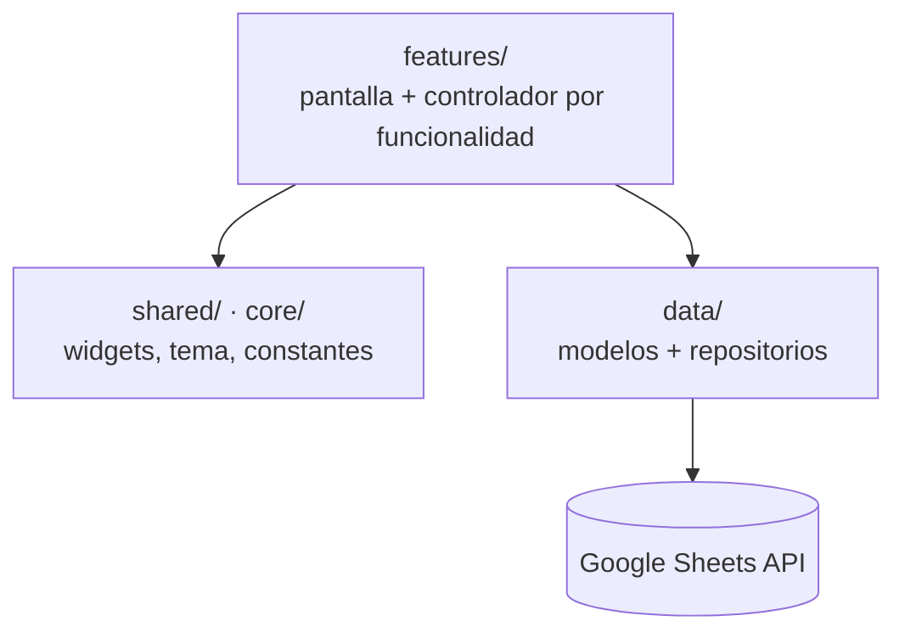

# Magnojet App

Aplicación móvil de inventario y cálculo de aplicación agrícola para Magnojet,
proveedor colombiano de tecnología de aspersión de precisión.


![CI]
(https://github.com/juan14857/Magnojet_app/actions/workflows/ci.yml/badge.svg)

---

## Por qué existe

Magnojet opera en cuatro sedes: Bogotá, Cereté, Villavicencio y Yopal. Antes de esta
app, consultar el inventario significaba abrir una hoja de cálculo y cruzar datos a
mano, y recomendar la boquilla correcta para una tasa de aplicación dada dependía de
la memoria del técnico o de las tablas impresas del catálogo.

Los dos problemas ocurren en el mismo momento —frente al cliente, en campo— y ninguno
se resolvía con la herramienta disponible. La app los junta: el inventario en vivo y el
motor de recomendación de boquillas viven en la misma pantalla que el técnico ya lleva
en el bolsillo.

---

## Funcionalidades

- **Inventario en tiempo real** — sincroniza existencias, precios e IVA desde Google
  Sheets, filtrable por las cuatro sedes.
- **Alertas de stock** — detecta productos agotados o con stock bajo y emite
  notificaciones locales en el dispositivo.
- **Búsqueda de productos** — por código o descripción sobre el inventario cargado.
- **Calculadora de tasa de aplicación (Q)**.
- **Calculadora de selección de boquilla (q)** — el cálculo inverso.
- **Motor de recomendación de boquillas** — cruza el resultado del cálculo contra 43
  series reales del catálogo.
- **Catálogo V40 digital** — visor de PDF integrado y paginado.

---

## El cálculo agronómico

Las dos calculadoras son la misma ecuación despejada en direcciones opuestas:

```
Tasa de aplicación      Q = (q × 600) / (V × E)
Caudal por boquilla     q = (Q × V × E) / 600
```

| Símbolo | Variable | Unidad |
|---|---|---|
| `Q` | Tasa de aplicación | L/ha |
| `q` | Caudal por boquilla | L/min |
| `V` | Velocidad de avance | km/h |
| `E` | Ancho de aplicación por boquilla | m |
| `600` | Constante de conversión de unidades | — |

El resultado no se entrega solo como un número. El servicio de emparejamiento lo cruza
contra el catálogo filtrando por dos taxonomías agronómicas simultáneas —**7 tamaños de
gota** (de muy finas a extremadamente gruesas) y **5 tipos de chorro** (plano, cónico,
deflectado, sólido, extendido)— y devuelve las series que efectivamente sirven para esa
aplicación. Es la parte del trabajo que antes vivía en la cabeza de alguien con años de
experiencia en campo.

---

## Arquitectura

Organización *feature-first*: cada funcionalidad agrupa su pantalla y su controlador,
en lugar de repartirlos por carpetas técnicas.



El estado se maneja con un controlador por pantalla usando `ChangeNotifier` y `provider`.
La lógica de negocio —el emparejamiento de boquillas— vive desacoplada de la interfaz,
así que se puede probar sin levantar Flutter.

```
lib/
├── app/         # MaterialApp, rutas, tema
├── core/        # constantes, tema, utilidades compartidas
├── data/        # modelos y repositorios (Google Sheets)
├── features/    # home · inventory · alerts · search · calculators · catalog
├── shared/      # widgets reutilizables
└── main.dart
```

---

## Cómo ejecutarlo

Requiere el [SDK de Flutter](https://docs.flutter.dev/get-started/install) y una API key
de Google Sheets con acceso de lectura a la hoja de inventario.

```bash
git clone https://github.com/juan14857/Magnojet_app.git
cd Magnojet_app

flutter pub get
```

**1. Coloca el catálogo.** El archivo `catalogo_v40_digital.pdf` va en `assets/docs/`.
No se versiona por su tamaño.

**2. Configura las credenciales.**

```bash
cp config/dev.json.example config/dev.json
# edita config/dev.json con tu API key
```

**3. Ejecuta.**

```bash
flutter run --dart-define-from-file=config/dev.json
```

Para compilar, el mismo flag:

```bash
flutter build apk --dart-define-from-file=config/dev.json
```

Las credenciales se inyectan en tiempo de compilación y nunca entran al código fuente.
`config/dev.json` está en `.gitignore`.

---

## Stack

| Componente | Elección |
|---|---|
| Framework | Flutter (Dart) |
| Estado | `provider` / `ChangeNotifier` |
| Datos | Google Sheets API vía `http` |
| Visor PDF | `flutter_pdfview` |
| Notificaciones | `flutter_local_notifications` |
| Utilidades | `path_provider`, `intl` |

**Por qué Google Sheets como fuente de datos:** el inventario ya vivía en hojas de
cálculo mantenidas por el equipo de cada sede. Montar una base de datos habría obligado
a cambiar el proceso de trabajo de cuatro sedes antes de que la app entregara valor
alguno. Leer directamente de la hoja existente permitió desplegar sin pedirle a nadie
que cambiara su forma de trabajar. El costo aceptado es el límite de cuota de la API y
la ausencia de consultas relacionales — un intercambio razonable mientras el volumen se
mantenga en el rango actual.

---

## Desarrollo

| Rama | Uso |
|---|---|
| `main` | Rama estable |
| `app_refactoring` | Desarrollo activo, se integra a `main` vía Pull Request |

```bash
flutter analyze     # análisis estático
flutter test        # pruebas
```

---

## Licencia

MIT © 2026 Juan Esteban Aldana Cortés